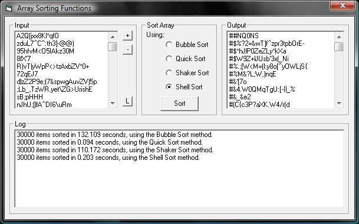



## Four Array Sorting Functions

### Description

This program provides you with four popular sorting functions. The Bubble Sort, the Shaker Sort (Also know as cocktail Sort), the Shell Sort and finially the Quick Sort.

The program also allows you to test all four functions agenst each other, to show what ones are the fastest.

Each sort function is placed in its own module so you can simply throw it right into whatever programs you may need it for.

Obviously I have not created any of these functions, all have been written in VB6 with help from various C++ code and various pseudocode.

More information on each function can be found on sites such as Wikipedi, which has example code for some functions.

P.S. There is actually a program contained with this example called "Generate List". This will allow you to generate a list of any size in no time. Such as the 30,000 item list i used in my screenshot.
 
### More Info
 

             |
---                |---
**Submitted On**   |2008-01-11 00:32:54
**By**             |[Goofy Goblin](https://github.com/Planet-Source-Code/PSCIndex/blob/master/ByAuthor/goofy-goblin.md)
**Level**          |Intermediate
**User Rating**    |4.5 (18 globes from 4 users)
**Compatibility**  |VB 6\.0
**Category**       |[Miscellaneous](https://github.com/Planet-Source-Code/PSCIndex/blob/master/ByCategory/miscellaneous__1-1.md)
**World**          |[Visual Basic](https://github.com/Planet-Source-Code/PSCIndex/blob/master/ByWorld/visual-basic.md)
**Archive File**   |[Four\_Array2096921102008\.zip](https://github.com/Planet-Source-Code/goofy-goblin-four-array-sorting-functions__1-69900/archive/master.zip)

